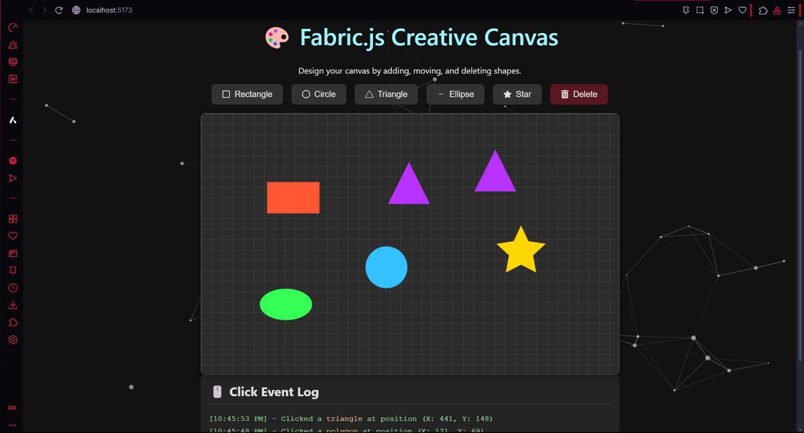

# 🎨 Fabric.js Creative Canvas

This is an interactive web application built with React and Fabric.js that provides a creative space for users to design and experiment with various shapes on a canvas. It showcases a modern, responsive UI with dynamic animations and a real-time event log.

### 🌐 **[Click here for Live Demo](https://nithish-ra.github.io/interactive-canvas/)**



---

## ✨ Core Features

- **Dynamic Shape Creation**: Add a variety of shapes (rectangles, circles, triangles, ellipses, and stars) to the canvas with a single click.
- **Complete Object Manipulation**: Seamlessly select, drag, and reposition any shape on the canvas with intuitive controls.
- **Delete Functionality**: Easily remove any selected shape from the canvas using the dedicated delete button.
- **Real-time Event Logging**: Instantly view data for any selected shape, including its type and `(x, y)` position, as soon as it's selected.
- **Stunning & Modern UI**: A polished, dark-themed interface featuring a grid-patterned canvas and professional icons for all controls.
- **Interactive Background Animation**: Features a dynamic, interactive "nexus" particle animation that responds to mouse movement, built with tsParticles.
- **Robust Component Architecture**: Built with a clean, scalable, and well-organized React component structure, separating canvas logic from UI state.

---

## 🛠️ Tech Stack

- **Frontend Framework**: [React](https://reactjs.org/) (bootstrapped with Vite for a fast development experience)
- **Canvas Library**: [Fabric.js](http://fabricjs.com/)
- **Animation**: [tsParticles](https://particles.js.org/)
- **Icons**: [React Icons](https://react-icons.github.io/react-icons/)
- **Styling**: Modern CSS3, including Flexbox for responsive layouts.

---

## 🚀 Getting Started

Follow these instructions to get a copy of the project up and running on your local machine for development and testing purposes.

### Prerequisites

You will need to have [Node.js](https://nodejs.org/en/) (version 18 or later) and `npm` installed on your machine.

### Installation

1.  **Clone the repository:**

    ```sh
    git clone (https://github.com/nithish-ra/interactive-canvas.git)
    ```

2.  **Navigate to the project directory:**

    ```sh
    cd fabricjs-interactive-canvas
    ```

3.  **Install NPM packages:**

    ```sh
    npm install
    ```

4.  **Start the development server:**
    ```sh
    npm run dev
    ```

The application will now be running and available at `http://localhost:5173`.

---

## 📂 File Structure

The project directory is organized as follows, separating configuration, public assets, and source code.

```
fabricjs-interactive-canvas/
│
├── node_modules/       # Project dependencies (managed by npm)
├── public/             # Static assets (e.g., favicon)
├── src/                # Main application source code
│   ├── components/
│   │   └── FabricCanvas.jsx  # Manages all Fabric.js canvas logic
│   │
│   ├── App.jsx         # Main application component, state, and layout
│   ├── index.css       # Global styles and theme
│   └── main.jsx        # React application entry point
│
├── .gitignore          # Specifies files for Git to ignore
├── eslint.config.js    # ESLint configuration
├── index.html          # Main HTML entry point for Vite
├── package-lock.json   # Records exact dependency versions
├── package.json        # Project metadata and dependencies
├── README.md           # This documentation file
└── vite.config.js      # Vite build configuration
```
